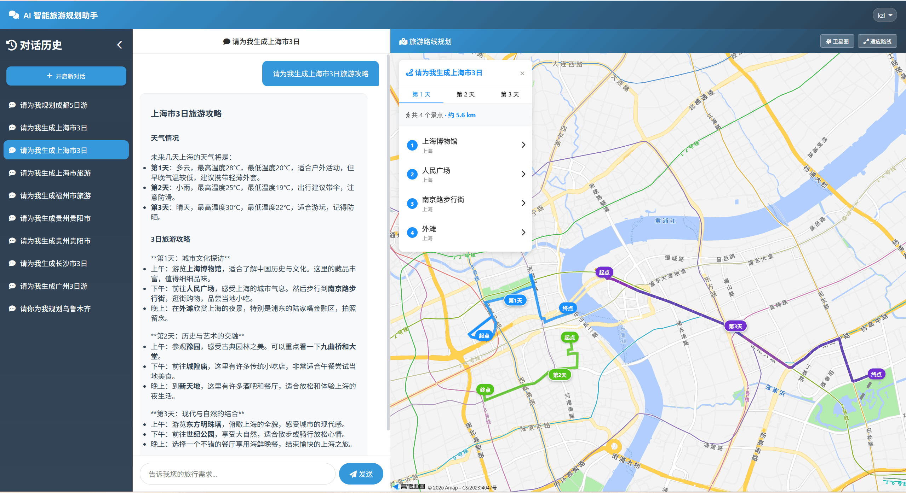

## AI 智能旅游规划助手（前端）

> **访问地址**：[https://www.aitrip.chat/](https://www.aitrip.chat/)  
> **欢迎体验智能旅游规划服务！**

## 目录

- [项目简介](#项目简介)
- [核心特性](#核心特性)
- [演示](#演示)
- [核心特性与架构特点](#核心特性与架构特点)
- [系统整体架构](#系统整体架构)
- [技术栈与依赖](#技术栈与依赖)
- [目录结构](#目录结构)
- [快速开始](#快速开始)
- [配置说明](#配置说明)
- [接口与集成](#接口与集成)
- [开发扩展指南](#开发扩展指南)
- [TODO](#todo)
- [参考文档](#参考文档)
- [License](#license)
- [联系与贡献](#联系与贡献)

## 项目简介

**AI-Tourism Frontend** 是智能旅游规划系统的**前端应用**，基于 **Vue 3、Vite、Leaflet、高德地图**等技术栈构建。

该前端应用作为用户交互界面，负责**对话展示、地图渲染、路线可视化**等核心功能。用户在前端输入自然语言后，请求会先发往 **ai-tourism-backend** 后端服务，然后由后端转发给 **ai-tourism-agent** Python Agent 服务进行 AI 处理。

## 核心特性

- **智能对话界面** - 支持流式对话展示，实时显示 AI 回复内容
- **地图可视化** - 集成高德地图和 OpenStreetMap，支持路线规划可视化
- **会话管理** - 支持多会话管理，历史记录查询，会话重命名和删除
- **用户认证** - 完整的用户登录、注册、权限管理功能

---

## 演示

### 前端效果截图


### 视频效果


---

## 核心特性与架构特点

### 1. 组件化与页面结构

- **视图与路由**：`Home.vue` 承载主界面（对话 + 地图 + 侧栏），`Login.vue` 负责登录/注册；路由统一在 `router` 中配置，需登录的页面通过鉴权守卫与后端 `Sa-Token` 配合。
- **核心组件**：`ChatContainer` 负责对话展示、用户输入与 SSE 消费；`MapContainer` 负责地图初始化、路线与 POI 展示；`Sidebar` 负责会话列表的增删改查与选中态，三者通过 props/事件与父组件通信。
- **样式与资源**：全局样式与公共资源集中在 `assets`，地图与 Markdown 等依赖通过 CDN 或 npm 按需引入。

### 2. 对话与流式响应

- **请求封装**：所有与后端的 HTTP 调用集中在 `utils/api.js`，包括登录、注册、会话列表、历史消息、删除/重命名会话以及发起流式对话；流式对话使用 `EventSource` 消费后端转发的 `POST /ai_assistant/chat-stream` 的 SSE 流。
- **展示与安全**：AI 回复支持 Markdown 渲染与代码高亮（如 Marked、Highlight.js），并对 HTML 做清理（如 DOMPurify）以降低 XSS 风险；流式内容按 chunk 追加到当前回复区域，提升体验。

### 3. 地图与可视化

- **双图源**：支持高德地图与 OpenStreetMap，通过 `mapConfig.js` 与 `mapServiceManager.js` 统一配置与切换；高德需配置 JS API Key、安全密钥与 Web 服务 Key，用于前端展示与地理编码。
- **路线与 POI**：规划结果中的路线与景点可由后端/Agent 回调写入，前端解析后在地图上绘制路线与标记点，并与对话内容联动展示。

### 4. 状态与联调

- **环境变量**：前端通过 Vite 的 `VITE_*` 注入后端地址（如 `VITE_API_BASE_URL`）、高德 Key 等，开发与生产可分别配置；本地联调时需保证后端与 Agent 已启动（默认端口 8290、8291），并注意 CORS 或同域代理配置。
- **认证与会话**：登录后 token 存于内存或持久化方式，请求头统一携带 `Authorization: Bearer <token>`；会话 ID 由后端分配，前端在请求历史与流式对话时透传，不维护业务侧会话状态。

---

## 系统整体架构

**AI 智能旅游规划系统**采用前后端分离架构。用户在前端输入自然语言后，请求经过后端 API 服务转发到 **Python Agent 服务**，由 Agent 服务调用工具获取天气、景点等信息，生成旅游路线规划。后端 API 服务负责处理流式返回、会话管理和数据持久化。

> 默认联调端口（以各项目配置为准）：前端 `3001`，后端 `8290`，Agent `8291`。建议先启动 Agent 与后端，再启动前端以便完整联调。

### 分层架构

整体为前端 → 后端 → Agent 三层，下图**侧重前端**结构；后端与 Agent 仅作概要。

```
┌─────────────────────────────────────────────────────────────────────────┐
│  前端 (Vue) · ai-tourism-frontend                                       │
│  ┌─────────────────────────────────────────────────────────────────┐   │
│  │ 视图与路由                                                        │   │
│  │  - views/Home.vue, Login.vue                                    │   │
│  │  - router 配置、鉴权守卫                                          │   │
│  └───────────────────────────┬─────────────────────────────────────┘   │
│  ┌───────────────────────────▼─────────────────────────────────────┐   │
│  │ 核心组件                                                         │   │
│  │  - ChatContainer.vue  对话区、SSE 消费、Markdown 渲染             │   │
│  │  - MapContainer.vue  地图与路线展示（Leaflet + 高德）             │   │
│  │  - Sidebar.vue       会话列表、新建/删除/重命名                    │   │
│  └───────────────────────────┬─────────────────────────────────────┘   │
│  ┌───────────────────────────▼─────────────────────────────────────┐   │
│  │ 工具与请求                                                        │   │
│  │  - utils/api.js  封装 login/register/chat-stream/session 等       │   │
│  │  - EventSource 消费 POST /ai_assistant/chat-stream 流式响应       │   │
│  └─────────────────────────────────────────────────────────────────┘   │
└─────────────────┬───────────────────────────────────────────────────────┘
                  │ HTTP/SSE (VITE_API_BASE_URL)
                  │
┌─────────────────▼────────────────────────────┐
│   后端 API 服务 (Spring Boot)                 │
│   ai-tourism-backend                          │
│   - API 网关与请求路由                         │
│   - 会话与消息管理                             │
│   - 用户认证与权限管理                         │
└─────────────────┬────────────────────────────┘
                  │ HTTP/SSE (agent.base-url)
                  │
┌─────────────────▼────────────────────────────┐
│   Python Agent 服务                           │
│   ai-tourism-agent                            │
│   - LangGraph 工作流                          │
│   - AI 意图识别与对话引导                      │
│   - 工具调用 (MCP/Function Call)              │
│   - 结构化输出                                │
└──────────────────────────────────────────────┘
```

### 架构说明

- **前端（ai-tourism-frontend）**：`Vue 3` 应用，负责交互、地图渲染与对话展示；通过 `SSE` 调用后端 `POST /ai_assistant/chat-stream` 实时消费模型输出

- **后端 API 服务（ai-tourism-backend）**：
  - **接入层（Controller + 鉴权）**：基于 `Spring Boot REST`，使用 `Sa-Token` 进行登录与权限校验，提供 RESTful API 接口
  - **业务服务层**：会话管理、消息入库、流式返回转发、API 网关功能
  - **数据访问层（MyBatis）**：通过 `MyBatis` 实现数据持久化，管理会话表、消息表、用户表等

- **Python Agent 服务（ai-tourism-agent）**：
  - **AI 对话处理**：LangGraph 工作流编排
  - **工具调用管理**：Function Call + MCP 工具
  - **状态管理**：使用 LangGraph Checkpoint 机制
  - **流式响应**：SSE 流式返回
  - **结构化输出**：JSON Schema 输出

---

## 技术栈与依赖

| 技术分类 | 技术栈 | 版本/说明 |
|---------|--------|----------|
| **核心框架** | Vue | `3.3.4` |
| **构建工具** | Vite | `4.5.14` |
| **路由** | Vue Router | `4.5.1` |
| **地图库** | Leaflet | CDN 引入 |
| **地图服务** | 高德地图 API | JavaScript API |
| **Markdown 渲染** | Marked | `16.3.0` |
| **代码高亮** | Highlight.js | `11.11.1` |
| **HTML 清理** | DOMPurify | `3.2.7` |

> 详见 [package.json](package.json) 依赖配置

---

## 目录结构

```
ai-tourism-frontend/
├── src/
│   ├── components/          # Vue 组件
│   │   ├── ChatContainer.vue    # 对话容器组件
│   │   ├── MapContainer.vue     # 地图容器组件
│   │   └── Sidebar.vue          # 侧边栏组件
│   ├── views/               # 页面视图
│   │   ├── Home.vue            # 首页
│   │   └── Login.vue           # 登录页
│   ├── utils/               # 工具函数
│   │   ├── api.js              # API 请求封装
│   │   ├── mapConfig.js        # 地图配置
│   │   └── mapServiceManager.js # 地图服务管理
│   ├── router/              # 路由配置
│   │   └── index.js
│   ├── assets/              # 静态资源
│   │   └── style.css
│   ├── App.vue              # 根组件
│   └── main.js              # 入口文件
├── public/                  # 公共静态资源
├── index.html               # HTML 模板
├── vite.config.js           # Vite 配置
├── package.json             # 项目依赖
├── .env.example             # 环境变量模板
├── .gitignore               # Git 忽略配置
└── README.md                # 项目说明
```

---

## 快速开始

> 建议启动顺序：`ai-tourism-agent` → `ai-tourism-backend` → `ai-tourism-frontend`。

### 1. 安装依赖

```bash
npm install
```

### 2. 配置环境变量

1. **复制环境变量模板**：
   ```bash
   # Windows
   copy .env.example .env.local
   
   # Linux/macOS
   cp .env.example .env.local
   ```

2. **编辑 `.env.local` 文件**，填入你的高德地图 API 密钥：
   ```env
   # 高德地图配置
   # 申请地址：https://console.amap.com/dev/key/app
   VITE_AMAP_API_KEY=your_amap_api_key_here
   VITE_AMAP_SECURITY_JS_CODE=your_security_js_code_here
   VITE_AMAP_WEB_API_KEY=your_web_api_key_here
   ```

   > **重要提示**：
   > - 高德地图 API 密钥申请地址：[https://console.amap.com/dev/key/app](https://console.amap.com/dev/key/app)
   > - 需要申请以下类型的密钥：
   >   - **Web 服务 API Key**（用于地理编码服务）
   >   - **Web 端（JS API）Key**（用于前端地图显示）
   >   - **安全密钥（Security JS Code）**（用于高德地图安全验证）
   > - `.env.local` 文件不会被提交到 Git，可以安全地存储你的密钥

### 3. 配置后端 API 地址（推荐使用环境变量）

本项目通过 Vite 环境变量 `VITE_API_BASE_URL` 配置后端地址：

- **开发环境**：默认已在 `.env.development` 配置为 `http://127.0.0.1:8290`
- **生产环境**：默认已在 `.env.production` 留空（使用相对路径），配合 Nginx 同域反向代理转发到后端

如需覆盖默认值，可在本地创建 `.env.local`（不会提交到 Git）：

```env
VITE_API_BASE_URL=http://127.0.0.1:8290
```

### 4. 启动开发服务器（开发环境）

```bash
npm run dev
```

项目将在 `http://localhost:3001` 启动。

### 5. 生产部署

#### 方式一：静态文件部署（推荐）

1. **构建项目**：
   ```bash
   npm run build
   ```

2. **部署 `dist/` 目录**：
   - 将 `dist/` 目录中的文件部署到静态文件服务器（如 Nginx、Apache、CDN 等）
   - 配置服务器支持 SPA 路由（所有路由指向 `index.html`）

3. **Nginx 配置示例**：
   ```nginx
   server {
       listen 80;
       server_name your-domain.com;
       root /path/to/dist;
       index index.html;

       location / {
           try_files $uri $uri/ /index.html;
       }
   }
   ```

#### 方式二：Docker 部署

1. **创建 Dockerfile**：
   ```dockerfile
   FROM node:18-alpine AS builder
   WORKDIR /app
   COPY package*.json ./
   RUN npm install
   COPY . .
   RUN npm run build

   FROM nginx:alpine
   COPY --from=builder /app/dist /usr/share/nginx/html
   COPY nginx.conf /etc/nginx/conf.d/default.conf
   EXPOSE 80
   CMD ["nginx", "-g", "daemon off;"]
   ```

2. **构建和运行**：
   ```bash
   docker build -t ai-tourism-frontend .
   docker run -d -p 80:80 ai-tourism-frontend
   ```

---

## 配置说明

### 环境变量文件

项目支持以下环境变量文件（按优先级从低到高）：

| 文件 | 用途 | 是否提交到 Git | 使用场景 |
|------|------|---------------|----------|
| `.env` | 所有环境的默认配置 | ✅ 是 | 团队共享的默认配置 |
| `.env.development` | 开发环境专用 | ✅ 是 | 开发环境的公共配置 |
| `.env.production` | 生产环境专用 | ✅ 是 | 生产环境的公共配置 |
| `.env.local` | 本地覆盖（所有环境） | ❌ 否 | 个人本地开发配置（推荐） |
| `.env.development.local` | 开发环境本地覆盖 | ❌ 否 | 个人开发环境配置 |
| `.env.production.local` | 生产环境本地覆盖 | ❌ 否 | 生产环境本地配置 |

### 必需的环境变量

| 变量名 | 说明 |
|--------|------|
| `VITE_AMAP_API_KEY` | 高德地图 JavaScript API Key |
| `VITE_AMAP_SECURITY_JS_CODE` | 高德地图安全密钥 |
| `VITE_AMAP_WEB_API_KEY` | 高德地图 Web API Key |

> **注意**：所有 Vite 环境变量必须以 `VITE_` 前缀开头，才能在客户端代码中通过 `import.meta.env.VITE_*` 访问。

---

## 接口与集成

### API 接口调用

前端通过 `src/utils/api.js` 封装了所有 API 请求，主要接口包括：

- **用户认证**：`login()`、`register()`、`logout()`、`me()`
- **会话管理**：`fetchSessionList()`、`deleteSession()`、`renameSession()`
- **AI 对话**：`sendMessage()`（支持 SSE 流式响应）

### 地图服务配置

地图服务配置在 `src/utils/mapConfig.js` 中，支持：
- **高德地图**：需要配置 API Key 和安全密钥
- **OpenStreetMap**：无需配置，可直接使用

### 流式响应处理

前端通过 `EventSource` 接收后端 SSE 流式响应，实时展示 AI 回复内容。相关代码在 `src/components/ChatContainer.vue` 中。

---

## 开发扩展指南

### 安全注意事项

1. **API 密钥安全**：
   - ⚠️ **不要**将包含真实密钥的 `.env.local` 文件提交到 Git
   - ✅ 使用 `.env.example` 作为模板，只提交占位符
   - ✅ 在高德地图控制台设置域名白名单，限制 API Key 的使用范围
   - ✅ 定期轮换 API 密钥

2. **前端环境变量限制**：
   - ⚠️ 前端环境变量会打包进代码，用户可以通过浏览器查看
   - ✅ 这是前端应用的特性，无法完全避免
   - ✅ 通过设置 API Key 的域名白名单和调用频率限制来降低风险

3. **生产环境建议**：
   - 使用 HTTPS 部署
   - 配置 CORS 策略
   - 设置 API Key 的调用频率限制

### 常见问题（FAQ）

#### 1）地图不显示/控制台提示 Key 无效

- 检查 `.env.local` 中 `VITE_AMAP_*` 是否填写正确
- 在高德控制台配置域名白名单（本地开发可临时放开或填 `localhost`）

#### 2）对话没反应或 SSE 断开

- 确认后端 `ai-tourism-backend` 已启动且可访问（默认 `http://127.0.0.1:8290`）
- 确认后端已正确配置并能访问 Agent（默认 `http://127.0.0.1:8291`）
- 浏览器网络面板查看 `/ai_assistant/chat-stream` 是否返回 `text/event-stream`

#### 3）跨域（CORS）问题

推荐前端通过 Nginx 同域反代后端，或在后端按需放开 CORS 策略（以实际部署为准）。

---

## TODO

### 1. 前端功能优化
- [ ] 优化流式响应展示效果，提升用户体验
- [ ] 支持对话内容编辑和重新发送
- [ ] 添加对话示例 prompt，用户可直接选择使用
- [ ] 优化地图交互，支持更多地图操作，例如地图上单击某个地点后，展示其详细信息（含图片与文字说明）

### 2. 用户体验优化
- [ ] 添加加载动画和骨架屏
- [ ] 优化移动端适配
- [ ] 添加错误提示和重试机制
- [ ] 支持主题切换（深色/浅色模式）

### 3. 功能扩展
- [ ] 支持路线规划结果导出为 H5 页面
- [ ] 地图上点击地点展示详细信息（含图片与文字说明）
- [ ] 支持跳转至各景点订单服务
- [ ] 添加帮助页面和使用指南

---

## 参考文档

- [Vue 文档](https://cn.vuejs.org/)
- [Vite 文档](https://vite.dev/)
- [Leaflet 文档](https://leafletjs.com/)
- [高德地图 JS API 文档](https://lbs.amap.com/api/javascript-api-v2/summary)

---

## License

本项目仅供学习使用，**禁止未经授权的商用**。

---

## 联系与贡献

欢迎任何建议、反馈与贡献！如需交流或有合作意向，欢迎通过以下方式联系：

- **微信**：`13859211947`
- **GitHub**：提交 Issue 或 PR 到本仓库
- **后端项目**：[ai-tourism-backend 仓库](https://github.com/1937983507/ai-tourism-backend) - Spring Boot 后端服务，提供 API 网关、会话管理、用户认证等功能
- **Agent 项目**：[ai-tourism-agent 仓库](https://github.com/1937983507/ai-tourism-agent) - 包含所有 AI Agent 相关功能（LangGraph 工作流、工具调用、AI 对话处理等）

如有 Bug、需求或想法，欢迎随时提出，我们会积极响应。
也欢迎 AI 应用开发相关的同学一起交流讨论。
