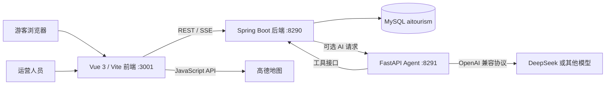

# 澳门文旅智联 v2.0 项目对接文档

> 文档用途：供下一次开发、调试、演示或交接时独立阅读，不依赖此前聊天上下文。
>
> 文档日期：2026-07-31
>
> 当前版本：v2.0.0
>
> 项目性质：澳门公益文旅智慧助手比赛原型，当前优先建设非商业服务闭环。

## 1. 一页摘要

系统已经完成以下业务闭环：

`匿名游客进入 -> 设置偏好和当前位置 -> 生成约束路线 -> 智能公交展示 -> 自然点位推荐 -> 运营注入事件 -> 游客实时收到提醒 -> 局部改线/整程重排 -> 撤回恢复 -> 提交反馈 -> 运营关闭工单`

当前版本适合比赛 Demo 和产品原型验证，尚不属于可直接面向公众上线的生产系统。路线硬约束由 Java 后端确定性引擎负责，Agent 不能覆盖 Java 的可行性结果。

### 当前验证状态

- 前端：Vue/Vite 生产构建通过，56 个模块。
- 后端：12 项自动化测试通过，0 失败，0 错误；MySQL 集成通过。
- Agent：Python 代码语法检查通过。
- 地图：全分类 60/60 个目录图标可显示。
- 路线：可从游客当前位置绘制首段，地图只保留唯一当前位置和唯一终点标记。
- 本地端口：前端 `3001`，Java 后端 `8290`，Agent 默认 `8291`。

## 2. 仓库和本地目录

### GitHub 发布仓库

- 仓库：<https://github.com/jiangbinwu2006-fzu/MacauAICompetition>
- 主分支：`main`
- v2 标签：`v2.0.0`
- v2 基线提交：`106032d06c7be5d537185941c6646fae168545e3`

### 本机目录

- 日常开发目录：`D:\我的湾区ai大赛\ai-tourism`
- GitHub 发布工作副本：`D:\我的湾区ai大赛\MacauAICompetition-release`
- 前端：`ai-tourism-frontend`
- Java 后端：`ai-tourism-backend`
- Python Agent：`ai-tourism-agent`
- 一键启停脚本：`scripts`
- 运行日志及 PID：`.runtime`

日常开发目录中的三个子项目各自保留原上游 Git 仓库；比赛发布统一同步到 `MacauAICompetition-release`。向比赛仓库推送前，必须排除 `.env`、`application.yml`、`.venv`、`node_modules`、`target`、`dist`、日志和 PID 文件。

## 3. 产品范围

### 已完成的非商业能力

- 匿名游客会话，登录不是游客主流程的前置条件。
- 会话级偏好：兴趣、时间、步行上限、必去点、交通、语言、无障碍和当前位置。
- 简中、繁中、英文、葡文四语切换。
- 澳门半岛、氹仔、路氹、路环共 60 个目录 POI。
- 按时间窗动态决定行程点数，不再固定为“半日游”。
- 必去点、最晚结束时间、步行上限、事件安全条件等硬约束校验。
- 高德地图、步行路线和“智能公交路线”。
- 自然 POI 推荐，不含广告权重。
- SSE 实时事件提醒。
- 局部改线、整程重排、撤回和恢复初始路线。
- 大字体、高对比、简化页面、文字路线和 TXT 导出。
- 游客反馈工单和公益运营看板。
- 两条固定演示路线：关闸一日往返、酒店一日往返。

### 明确延期的商业能力

- 商户自助入驻和商户后台。
- 广告、赞助、投放、审核、预算和结算。
- 商业曝光频控、双轨公平流量及反作弊。
- 支付、充值和真实商业结算。

除非用户明确改变优先级，否则应先保证公益闭环稳定，不提前开发商业模块。

## 4. 系统架构



### 技术栈

| 层级 | 技术 |
|---|---|
| 前端 | Vue 3、Vue Router、Vite、原生 Fetch、高德 JavaScript API |
| 后端 | Java 21、Spring Boot 3.5.6、Spring MVC/WebFlux、MyBatis、Sa-Token、MySQL |
| Agent | Python 3.11+、FastAPI、LangGraph、LangChain、OpenAI 兼容接口 |
| 地图 | AMap PlaceSearch、Walking、Transfer |
| 实时事件 | Spring SSE / `text/event-stream` |
| 测试 | JUnit 5、Spring Boot Test、MockMvc、Vite 构建 |

## 5. 核心设计原则

1. **Java 决定路线是否可行。** Agent 只做自然语言偏好提取、澳门提示词和多语解释，不得直接生成或覆盖硬约束结果。
2. **先安全、再顺路、最后偏好。** 生效事件、过期数据、闭馆和硬约束先过滤，再做距离与兴趣排序。
3. **当前位置是真实路线起点。** GPS 坐标直接进入当前游客会话；手动选点使用高德解析后的坐标。地图必须补画“当前位置到第一站”的首段。
4. **商业内容不进入当前版本。** 普通餐饮、零售、康养点只作为自然 POI。
5. **在线服务失败必须降级。** 地图或公交失败时保留静态距离、交通文字和来源提示，不伪造在线结果。
6. **隐私最小化。** 匿名游客的位置和偏好默认只存在当前会话，不绑定手机号。

## 6. 环境准备

### 必要软件

- Node.js 18+
- Java 17+，当前本机验证使用 Java 21
- Maven 3.9+ 或项目自带 Maven Wrapper
- Python 3.11+
- MySQL 8+

### 前端配置

在 `ai-tourism-frontend` 中复制 `.env.example` 为 `.env.local`：

```dotenv
VITE_AMAP_API_KEY=你的高德JavaScript_API_Key
VITE_AMAP_SECURITY_JS_CODE=你的高德Security_JS_Code
VITE_AMAP_WEB_API_KEY=你的高德Web_API_Key
```

开发环境 API 地址由 `.env.development` 指向 `http://127.0.0.1:8290`。生产环境 `.env.production` 默认使用同域反向代理。

### Java 后端配置

复制：

```text
ai-tourism-backend/src/main/resources/application-example.yml
```

为：

```text
ai-tourism-backend/src/main/resources/application.yml
```

必须配置：

- `spring.datasource.url`
- `spring.datasource.username`
- `spring.datasource.password`
- `sa-token.jwt-secret-key`
- 可选 `agent.base-url`、`agent.internal-token`
- 可选 `openai.api-key`、`openai.base-url`、`openai.model-name`

### Agent 配置

复制 `ai-tourism-agent/.env.example` 为 `.env`。如使用 DeepSeek，将其作为 OpenAI 兼容服务配置：

```dotenv
OPENAI_API_KEY=你的模型密钥
OPENAI_BASE_URL=模型供应商的兼容接口地址
OPENAI_MODEL_NAME=模型名称
JAVA_SERVICE_URL=http://localhost:8290
AGENT_PORT=8291
AGENT_HOST=0.0.0.0
```

本文档和 Git 仓库都不保存实际 MySQL 密码、DeepSeek 密钥或高德密钥。不要从历史聊天复制密钥到源码、README 或提交记录中。

## 7. 数据库初始化

数据库名为 `aitourism`。澳门目录迁移文件：

```text
ai-tourism-backend/sql/migrations/V20260727_01__macau_catalog.sql
```

执行示例：

```powershell
mysql -u root -p < .\ai-tourism-backend\sql\migrations\V20260727_01__macau_catalog.sql
```

迁移会创建 `t_macau_catalog_poi` 并写入 60 个四语 POI。主要字段包括：

- `poi_code`、`region`、`category`
- 四语名称和描述
- 经度、纬度、营业时间、无障碍等级
- 来源机构、来源 URL、发布时间、有效期
- 是否自然商户、状态

点位分布：澳门半岛 20、氹仔 14、路氹 12、路环 14。名称和当前目录坐标见 `docs/MACAU_POI_ADDRESS_REVIEW.md`。

## 8. 安装、构建与启动

### 首次安装

```powershell
cd D:\我的湾区ai大赛\ai-tourism\ai-tourism-frontend
npm install
npm run build

cd ..\ai-tourism-backend
.\mvnw.cmd test
.\mvnw.cmd package -DskipTests

cd ..\ai-tourism-agent
python -m venv .venv
.\.venv\Scripts\Activate.ps1
pip install -r requirements.txt
```

### 一键启动前端和 Java 后端

在项目根目录执行：

```powershell
.\start-project.cmd
```

启动脚本会：

- 在 `3001` 启动 Vite 前端。
- 在 `8290` 启动 Java 后端。
- 使用隐藏进程运行。
- 通过 `backend-supervisor.ps1` 监控后端，异常退出 3 秒后重启。
- 将 PID 和日志写入 `.runtime`。
- 优先加载 `target/ai-tourism-2.0.0.jar`，不存在时选择 `target` 中最新的 `ai-tourism-*.jar`。

注意：一键脚本不会安装依赖，也不会自动启动 Python Agent。启动前必须确保后端 JAR 已构建。

### 单独启动 Agent

```powershell
cd .\ai-tourism-agent
.\.venv\Scripts\Activate.ps1
python run.py
```

### 停止项目

```powershell
.\stop-project.cmd
```

### 页面地址

- 游客端：<http://localhost:3001/explore>
- 运营端：<http://localhost:3001/ops>
- 原登录后主页：<http://localhost:3001/home>
- Java 后端：<http://localhost:8290>
- Agent 健康检查：<http://localhost:8291/agent/health>

## 9. 身份与会话

### 匿名游客

1. 进入 `/explore`。
2. 前端调用 `POST /auth/guest`。
3. 游客 Token 写入 `sessionStorage.guest_token`。
4. 后续请求使用 `Authorization: Bearer <token>`。
5. Token 过期或返回 `1101` 时，前端自动创建新游客会话并重试偏好、路线或反馈请求。

游客偏好、当前位置和路线存储在 Sa-Token 当前会话中，后端重启或会话过期后会丢失。只有用户主动登录后，才应考虑跨会话保存。

### 正式登录

保留原 `/auth/login`、`/auth/register`、`/auth/refresh`、`/auth/logout` 和 `/ai_assistant` 接口。登录 Token 存在 `localStorage`，游客 Token 存在 `sessionStorage`。

## 10. 主要 API

所有 Java 业务响应统一为：

```json
{
  "code": 0,
  "msg": "ok",
  "data": {}
}
```

### 身份

| 方法 | 路径 | 说明 |
|---|---|---|
| POST | `/auth/guest` | 创建临时游客会话 |
| POST | `/auth/login` | 登录 |
| POST | `/auth/register` | 注册 |
| GET | `/auth/me` | 当前用户 |
| POST | `/auth/refresh` | 刷新令牌 |
| POST | `/auth/logout` | 退出 |

### 目录与偏好

| 方法 | 路径 | 说明 |
|---|---|---|
| GET | `/api/catalog/pois?region=&category=&q=&lang=zh-Hans` | 获取 60 点位目录 |
| GET | `/api/preferences` | 获取当前会话偏好 |
| PUT | `/api/preferences` | 保存当前会话偏好 |
| DELETE | `/api/preferences` | 重置偏好和位置 |

偏好请求示例：

```json
{
  "interests": ["CULTURE", "FOOD"],
  "departure_time": "09:00",
  "latest_end_time": "18:00",
  "max_walking_meters": 5000,
  "must_visit_poi_ids": [1],
  "transport_preference": "MIXED",
  "language": "zh-Hans",
  "accessibility_needs": [],
  "current_longitude": 113.5627,
  "current_latitude": 22.1488,
  "current_location_name": "澳门威尼斯人",
  "location_source": "MANUAL"
}
```

### 路线

| 方法 | 路径 | 说明 |
|---|---|---|
| POST | `/api/trips` | 按当前偏好生成路线 |
| GET | `/api/trips/current` | 获取当前路线 |
| DELETE | `/api/trips/current` | 清空当前路线 |
| POST | `/api/trips/demo/GATE_LOOP` | 关闸一日往返演示路线 |
| POST | `/api/trips/demo/HOTEL_LOOP` | 酒店一日往返演示路线 |
| POST | `/api/trips/{tripId}/recommendations/{poiCode}` | 加入自然推荐 |
| DELETE | `/api/trips/{tripId}/recommendations/{poiCode}` | 忽略/撤回推荐 |
| POST | `/api/trips/{tripId}/reroute?mode=LOCAL` | 局部改线 |
| POST | `/api/trips/{tripId}/reroute?mode=GLOBAL` | 整程重排 |
| POST | `/api/trips/{tripId}/undo` | 撤回最近改线 |
| POST | `/api/trips/{tripId}/restore` | 恢复初始路线 |

路线响应包含：`stops`、`legs`、`transport_options`、`recommendations`、`conflicts`、`warnings`、`comparison`、`static_fallback` 等字段。只要硬约束冲突仍存在，后端不得返回伪成功路线。

### 事件和反馈

| 方法 | 路径 | 说明 |
|---|---|---|
| GET | `/api/events` | 查询生效事件 |
| GET | `/api/events/stream` | SSE 实时事件流 |
| POST | `/api/feedback` | 游客提交反馈 |
| GET | `/api/ops/dashboard` | 公益运营指标 |
| GET/POST | `/api/ops/events` | 查询/创建运营事件 |
| PUT | `/api/ops/events/{eventId}` | 编辑事件 |
| PATCH | `/api/ops/events/{eventId}/status?status=` | 启用、撤销或过期事件 |
| GET | `/api/ops/feedback` | 查询反馈工单 |
| PATCH | `/api/ops/feedback/{feedbackId}` | 处理或关闭工单 |
| POST | `/api/ops/demo/road-closure?poiCode=` | 快速注入模拟封路 |
| POST | `/api/ops/demo/reset` | 重置事件、工单、指标和当前路线 |

事件支持类型 `ROAD_CLOSURE`、暴雨和场馆关闭；严重度分普通、中度和高危。事件请求的 `affected_poi_codes` 支持多个地点。

### Agent

| 方法 | 路径 | 说明 |
|---|---|---|
| GET | `/agent/health` | Agent 健康状态及版本 |
| GET | `/agent/tools` | 工具清单 |
| POST | `/agent/chat` | 非流式聊天 |
| POST | `/agent/chat-stream` | SSE 流式聊天 |

Java 后端通过 `/ai_assistant/chat-stream` 代理 Agent，原会话列表、历史记录和回调接口仍保留。

## 11. 路线与地图实现说明

### Java 路线引擎

- 根据 `departure_time` 到 `latest_end_time` 的可用时间动态选择 1–8 个点。
- 必须包含未受安全事件影响的必去点。
- 校验时间窗、最晚结束、最大步行距离和事件冲突。
- 候选点按当前位置/上一节点距离、兴趣、区域、无障碍和稳定点位代码排序。
- 预留停留时间和安全缓冲。
- 地图失败时可返回静态距离与文字路线。
- 改线完成后再次执行全部硬约束检查，冲突数必须为 0。

### 高德地图前端

- 全域目录图标不会直接相信数据库示例坐标；会通过 `AMap.PlaceSearch` 获取澳门范围内的真实位置。
- 常见名称差异使用别名，例如关闸、东望洋灯塔、玫瑰圣母堂等。
- 成功坐标写入浏览器本地缓存 30 天。
- 首次解析按每批 2 个请求渐进执行，避免高德瞬时调用过多。
- 浏览目录时显示 60 个分类图标；生成路线后隐藏目录图标以减少遮挡。
- 普通路线使用当前位置作为地图起点，先画当前位置到第一站，再画后续路段。
- 600 米以内优先步行；较长 `PUBLIC_TRANSIT` 路段调用 `AMap.Transfer`。
- 公交详情显示路线、上车站、途经站、下车站和站点坐标。
- 高德结果出现珠海、拱北、横琴或异常超长线路时，演示路线会降级，避免明显跨境绕行。

## 12. 数据持久化边界

| 数据 | 当前存储 | 重启后 |
|---|---|---|
| 60 个澳门目录 POI | MySQL `t_macau_catalog_poi` | 保留 |
| 正式用户、原聊天会话和消息 | MySQL 原项目表 | 保留 |
| 游客偏好和当前位置 | Sa-Token 会话 | 丢失 |
| 当前路线和路线版本 | Sa-Token 会话 | 丢失 |
| 运营事件 | Java 内存 `ConcurrentHashMap` | 丢失 |
| 反馈工单 | Java 内存 `ConcurrentHashMap` | 丢失 |
| 运营统计 | Java 内存 | 丢失 |
| 地图 POI 真实坐标 | 浏览器 `localStorage`，30 天 | 浏览器内保留 |
| Agent Checkpoint | 由 `.env` 的 memory/sqlite/postgres 决定 | 取决于配置 |

因此，当前运营事件、反馈和统计均为 Demo 数据。生产化前必须迁移到数据库并增加审计、权限和数据生命周期管理。

## 13. 固定演示故事线

### 建议现场流程

1. 打开 `/explore`，确认临时游客身份。
2. 在偏好中手动选择澳门起点或主动获取浏览器定位。
3. 设置 `09:00–18:00`、兴趣、步行上限和必去点并保存。
4. 生成路线，确认“硬约束全部通过”。
5. 查看智能公交路线、上车站和下车站。
6. 加入一个自然餐饮或补给点，确认绕行增量和约束仍通过。
7. 另开 `/ops`，选择一个或多个当前路线地点，发布模拟封路。
8. 游客页无需刷新收到 SSE 事件提醒。
9. 执行局部改线，比较时间、步行和绕行变化。
10. 撤回改线或恢复初始路线。
11. 游客提交反馈，运营端处理并关闭工单。

### 两条保底路线

- `GATE_LOOP`：关闸广场出发并返回关闸。
- `HOTEL_LOOP`：澳门威尼斯人出发并返回澳门威尼斯人。

现场演示前应预热高德地点缓存，并提前验证网络、公交结果和 API 配额。

## 14. 测试与验收

### 前端

```powershell
cd ai-tourism-frontend
npm run build
```

还需人工检查：

- 桌面端和 `390x844` 移动端无溢出。
- 四语切换无需刷新且核心流程无混杂语言。
- 目录模式显示 60 个图标。
- 行程模式无数字节点、无多个起点。
- 当前定位标记、终点标记、公交线路和站点一致。

### 后端

```powershell
cd ai-tourism-backend
.\mvnw.cmd test
```

当前基线为 12 项测试。重点断言：

- 必去点、时间窗、步行上限和最晚结束违反数为 0。
- 短时间窗和长时间窗生成的点位数不同。
- 改线后事件冲突点残留为 0。
- 更新当前位置后整程重排从最新位置出发。
- 两条固定演示路线可行且回到起点。

### Agent

```powershell
cd ai-tourism-agent
.\.venv\Scripts\python.exe -m compileall -q app
```

Agent 不是路线硬约束验收依据。模型不可用时，游客路线核心流程仍应通过 Java 后端工作。

## 15. 已知限制与风险

1. 60 个目录点位虽已通过高德运行时解析，但名称、开放时间、官方来源和有效期仍需逐项人工复核。
2. 高德地图和公交详情依赖网络、API Key、配额和供应商实时结果。
3. 浏览器 GPS 与高德坐标系的转换应在生产化前专项核验，尤其是真机定位偏移。
4. 运营事件、反馈和指标当前仅在内存中，后端重启会清空。
5. 运营接口当前以 Demo 为主，生产化前必须增加运营/管理员角色鉴权。
6. 高危事件仍需接入澳门官方实时数据源和官方求助渠道。
7. 目录数据的 `valid_until` 当前主要到 2027-12-31，必须建立定期更新和自动失效流程。
8. Agent 的 RAG、天气和 LangSmith 配置来自原项目，未作为 v2 公益路线闭环的强依赖。
9. 现场断网时只能使用静态文字降级；公交细节无法保证实时生成。
10. 商业投放、公平流量、结算和支付尚未开发。

## 16. 开发流程约束

用户要求执行“单功能验收门禁”：

1. 每次只处理当前明确任务或 Bug。
2. 完成后必须停止推进，提交访问地址、操作步骤和测试结果。
3. 等用户明确回复“验收通过”后，才能进入下一任务。
4. 验收失败时只修当前任务，不提前开发后续功能。
5. 每个新 Bug 都要追加到 `docs/BUGFIX_CHANGELOG.md`。
6. 修改地图坐标时优先使用高德真实结果，不用人工坐标伪装成功。
7. 高德调用应尽量少，优先复用缓存和已有路线渲染结果。
8. 所有提交前执行前端构建、后端测试、敏感信息扫描和 `git diff --check`。
9. 不提交真实密钥、密码、日志、数据库文件、依赖目录或构建产物。

## 17. Git 发布流程

比赛发布仓库位于：

```text
D:\我的湾区ai大赛\MacauAICompetition-release
```

建议步骤：

```powershell
git status --short
git diff --check
git add <明确文件>
git diff --cached --stat
git commit -m "fix: ..."
git push origin main
```

发布前使用精确字符串检查用户曾提供过的密钥，确认没有进入暂存区。不要使用 `git add .` 将未知临时目录一起提交。

## 18. 文档索引

- 根说明：`README.md`
- v2 发布说明：`docs/RELEASE_NOTES_v2.0.0.md`
- BUG 完整日志：`docs/BUGFIX_CHANGELOG.md`
- 60 点位核对：`docs/MACAU_POI_ADDRESS_REVIEW.md`
- T01–T04：`docs/T01_CHANGELOG.md` 至 `docs/T04_CHANGELOG.md`
- T05–T16：`docs/T05_T16_CHANGELOG.md`
- Agent API：`ai-tourism-agent/doc/API.md`
- 后端迁移说明：`ai-tourism-backend/doc/migration-plan.md`

## 19. 下一次接手时的最短路径

1. 阅读本文件，不需要先恢复历史聊天。
2. 在开发目录和发布目录分别运行 `git status --short`，不要覆盖未提交变更。
3. 检查 `application.yml`、前端 `.env.local` 和 Agent `.env` 是否存在，但不要输出真实值。
4. 检查 MySQL `aitourism` 和 `t_macau_catalog_poi`，目录应为 60 条。
5. 运行后端测试和前端构建。
6. 启动项目并访问 `/explore`、`/ops`。
7. 先执行固定酒店路线或关闸路线，确认地图和公交正常。
8. 查看 `BUGFIX_CHANGELOG.md` 最新编号，后续 Bug 从 BUG-24 继续。
9. 开始修改前向用户说明本次改动；完成后按单任务验收门禁停止。

---

维护提醒：这份文档是项目对接基线。版本、端口、接口、持久化方式、演示故事线或开发规则发生变化时，应同步更新本文件。
